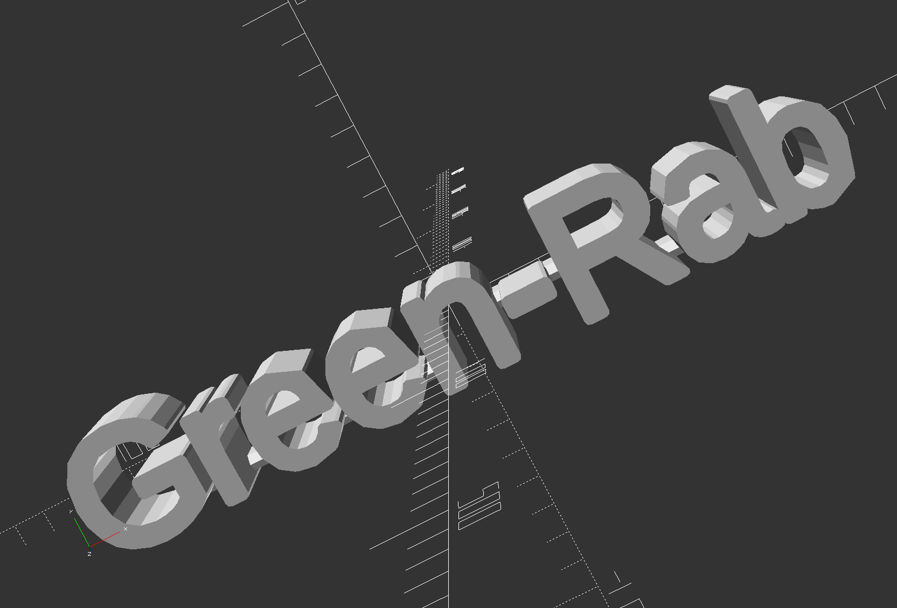
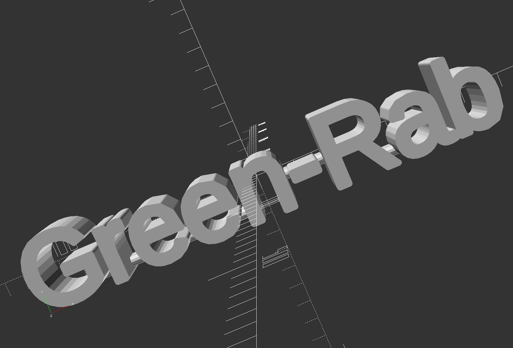
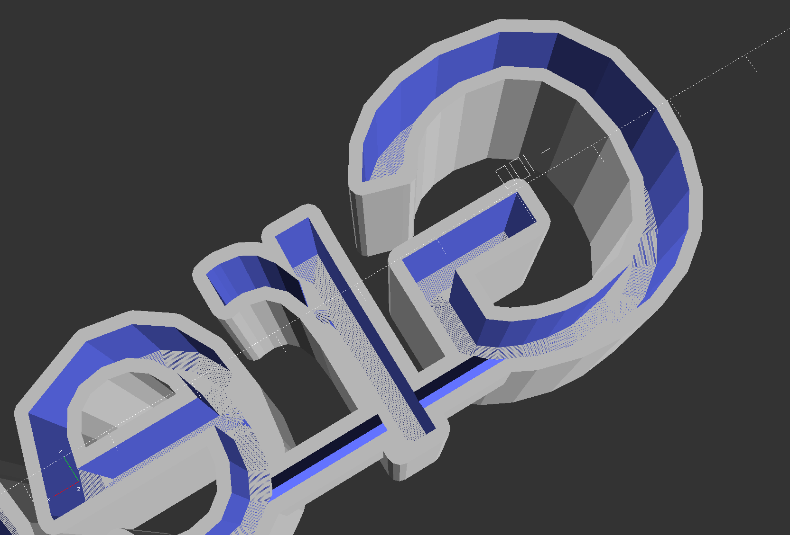

# ShiNa - Shining Name #

Create a name tag illuminated by LEDs. The cad construction is printed in 3d by using transparent material like PLA and an LED stripe is fixed in a slot at the back inside of the characters for illumination in different colors and modes.


Software for cad construction: OpenSCAD 2015.03:
- [https://openscad.org](https://openscad.org)
- [https://github.com/openscad/openscad](https://github.com/openscad/openscad)

## Overview ##

The script is separated in two modules:
- __shiningName.scad__ includes the algorithm for generating the whole name tag
- __name_green-rab.scad__ is the user specific file for configuring all parameters including the desired name and execute the method for generating the name tag

*To create a new name only copy the file and following the configuration steps below.*

## Preparing your own name ##

First copy the file __name_green-rab.scad__ as your template, all changes that are necessary have to be done here.

Always use the **DEBUG** resolution parameters that realize the rendering in the preview very fast. Parameters for **RENDERING** are only used in the last step and have to be adapted to get the best final result for STL export and printing.

```
// for DEBUG
_fn_u1 =  8;
_fn_u2 =  4;
_fn_d1 =  4;
_fn_d2 =  4;

_tmp_d1_deltaAngle =  60.0; //°
_tmp_d1_deltaSteps =   6.0; //mm

// for RENDERING
/*
_fn_u1 = 20;
_fn_u2 = 12;
_fn_d1 =  6;
_fn_d2 =  4;

_tmp_d1_deltaAngle =  10.0; //°
_tmp_d1_deltaSteps =   0.2; //mm
*/
```

### Choose the text ###

Choose the desired name or text, the font-size and its height (or depth) of the single characters by defining the variables below. The font-type can be changed if desired, too.

```
// u1: text
_u1_text           = "Green-Rab";
_u1_font           = "Dotum:style=Thin";
_u1_size           =  36;
_u1_height         =  30.0; //mm
```

### Define the connectors ###

For the print the single characters have to be connected by lines between them. This has to be done manually and is the work where most time has to be investigated.

In the first step define the width and the height of the lines for connecting the characters. Then the count of lines align (horizontal) and in upper direction (vertical) has to be specified. In the last step there are three vectors that define for each line length, position in x and position in y direction. It has to be adapted step by step.

*(For easier adaption of the lines they are highlighted in the preview mode by using the '#' tag in the method for generation)*

```
// u2: connectors
_u2_w              =   5.0; //mm
_u2_h              =  10.0; //mm

_u2_n_align        =   6;
_u2_n_up           =   0;

_u2_l              = [ 34.0,  14.0,  12.0, 26.0,  12.0,   8.0]; //mm
_u2_pos_x          = [-75.0, -39.0, -13.0, 24.0,  67.0,  95.0]; //mm
_u2_pos_y          = [-14.0, -14.0, -14.0, -4.0, -14.0, -16.0]; //mm
```

### Slot for LEDs ###

Only the fourth and fifth line have to be changed if the height of the characters is changed before. They define the slot for the LEDs inside single characters that is pointed on the top for better printing results. By changing these parameters the inner height for the slot can be adjusted if desired.

```
// d1: slot for LEDs
_d1_text           = _u1_text;
_d1_font           = _u1_font;
_d1_size           = _u1_size;
_d1_height         =  18.0; //mm
_d1_height2        =   5.0; //mm
_d1_deltaAngle     = _tmp_d1_deltaAngle;
_d1_deltaSteps     = _tmp_d1_deltaSteps;
```

### Notch for connectors ###

Last step is the notch for the connectors between the characters where the LED stripe and its wire is passed from character to character. Mostly it has not to be changed.

```
// d2: notch for connectors
_d2_width          =   2.0; //mm
```

### Rendering with DEBUG parameters ###

The result for using the DEBUG resolution parameters is shown below. All connectors have to be checked that they are at the right place. Mostly it takes a while to adjust them all.



This model can be exported as STL-file. But for the final version for printing the resolution parameters should be changed to RENDERING at the top.

## Rendering the construction ##

As a hint I always load the file with debug parameters. After the automatic preview is finished I change the resolution parameters by commenting and uncommenting the code blocks and execute the rendering directly. It has only reasons in performance, the rendering could take very long and should be done after the construction is checked carefully.

The result is shown below. Characters are rendered and the result is more detailed than the version with the DEBUG resolution parameter set above.



On the back there is the slot for the LED stripes and the notch in the extra lines between the single characters. The top inside is pointed for better printing results (no support construction needed).



The rendered cad construction can be exported as an STL file for printing the name tag.

## Insert the LED stripe ##

... tbd ...