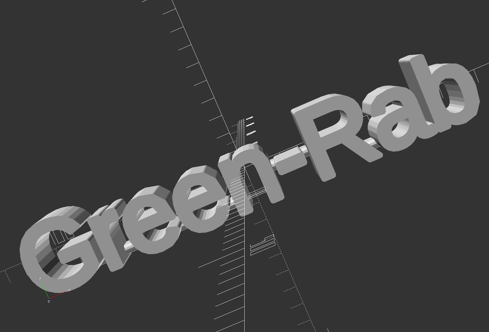
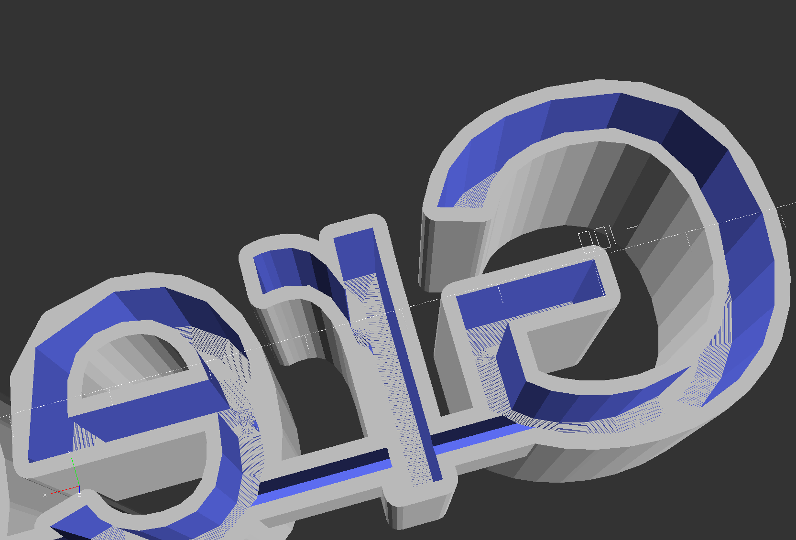

# Shining Name #

[[Overview](#overview)] [[Rendering](#rendering)] [[HowTo - CreateOwnShiningName](#howToCreateOwnShiningName)]

Create a name tag illuminated by LEDs. The cad construction is printed in 3D by the use of transparent material e.g. PLA. An LED stripe is fixed inside the slot at the back of the characters. Here a LED stripe is used for illumination in different colors and modes.


https://user-images.githubusercontent.com/81587537/195992513-063a43d0-b022-4d0c-b6d0-a63324b67925.mp4

Software for cad construction: OpenSCAD 2015.03
- [https://openscad.org](https://openscad.org)
- [https://github.com/openscad/openscad](https://github.com/openscad/openscad)

<a name="overview"></a>
## Overview ##

Files of the script:

- __shiningName.scad__ includes the algorithm for generating the name tag
- __name_green-rab.scad__ is the user specific file for configuring all parameters including the desired name and executes the method for generating the name tag

_Remark: To create a new name only copy the user specific file and follow the configuration steps below in the howto_

Version history:

<table>
	<tr>
		<th align="center">Version</th>
		<th align="left">New features</th>
		<th align="left">Resolved bugs</th>
	</tr>
	<tr></tr>
	<tr>
		<td align="center">v0.1</td>
		<td align="left">first version for initial test</td>
		<td align="left">-</td>
	</tr>
</table>

<a name="rendering"></a>
## Rendering

Result of the rendered script for each version.

<details open>
<summary>v0.1</summary>
<table>
	<tr>
		<th align="left">Rendered front view</th>
		<th align="left">... and back view of the name tag</th>
	</tr>
	<tr></tr>
	<tr>
		<td></td>
		<td></td>
	</tr>
</table>
</details>

_Remark: The slot of the characters at its back is pointed to the top for a better printing result (no support construction needed)_

<a name="howToCreateOwnShiningName"></a>
## HowTo - CreateOwnShiningName ##

First copy the file __name_green-rab.scad__ as your template, all changes that are necessary have to be done only inside this file.

Always use the **DEBUG** resolution parameters that realize the rendering in the preview very fast. Parameters for **RENDERING** are only used in the last step and have to be adapted to get the best final result for STL export and 3D print.

```
// for DEBUG
_fn_u1 =  8;
_fn_u2 =  4;
_fn_d1 =  4;
_fn_d2 =  4;

_tmp_d1_deltaAngle =  60.0; //°
_tmp_d1_deltaSteps =   6.0; //mm

// for RENDERING
/*
_fn_u1 = 20;
_fn_u2 = 12;
_fn_d1 =  6;
_fn_d2 =  4;

_tmp_d1_deltaAngle =  10.0; //°
_tmp_d1_deltaSteps =   0.2; //mm
*/
```

### Choose the text ###

Choose your desired name or text. The font size and its height (or depth) of the single characters are defined by the variables below.

```
// u1: text
_u1_text           = "Green-Rab";
_u1_font           = "Dotum:style=Thin";
_u1_size           =  36;
_u1_height         =  30.0; //mm
```

### Define the connectors ###

In the print the single characters are connected by lines between them. This has to be done manually and its the step where most of time has to be investigated.

First define the width and the height of the lines for connecting the characters. Then the count of lines align (horizontal) and in upper direction (vertical) has to be specified. In the last step there are three vectors that define the length, position in x and position in y direction for each line.

_Hint: Adapt the length and position step by step and highlight them in the preview mode by using the '#' tag in the method for generation_

```
// u2: connectors
_u2_w              =   5.0; //mm
_u2_h              =  10.0; //mm

_u2_n_align        =   6;
_u2_n_up           =   0;

_u2_l              = [ 34.0,  14.0,  12.0, 26.0,  12.0,   8.0]; //mm
_u2_pos_x          = [-75.0, -39.0, -13.0, 24.0,  67.0,  95.0]; //mm
_u2_pos_y          = [-14.0, -14.0, -14.0, -4.0, -14.0, -16.0]; //mm
```

### Slot for LEDs ###

Most variables are carried over from the section before. Only the fourth and fifth line can be changed that is necessary if the height of the characters is adapted. They define the slot for the LEDs inside the single characters and is pointed on the top for a better printing result.

```
// d1: slot for LEDs
_d1_text           = _u1_text;
_d1_font           = _u1_font;
_d1_size           = _u1_size;
_d1_height         =  18.0; //mm
_d1_height2        =   5.0; //mm
_d1_deltaAngle     = _tmp_d1_deltaAngle;
_d1_deltaSteps     = _tmp_d1_deltaSteps;
```

### Notch for connectors ###

Last step is the notch for the connectors between the characters where the LED stripe and its wire is passed from character to character. In most cases there is no change necessary.

```
// d2: notch for connectors
_d2_width          =   2.0; //mm
```

### Check, render and STL-export ###

All connectors have to be checked that they are at the right place. Mostly it takes a while to adjust them all. Look from each side and zoom to the connectors to check if there is something wrong.

As a hint I always load the file with debug parameters for performance reasons. After the automatic preview is finished I change the resolution parameters by commenting and uncommenting the code blocks and then execute the rendering directly with the RENDERING parameters.

**Finished!** The rendered cad construction can now be exported as an STL file for a 3D print. 
